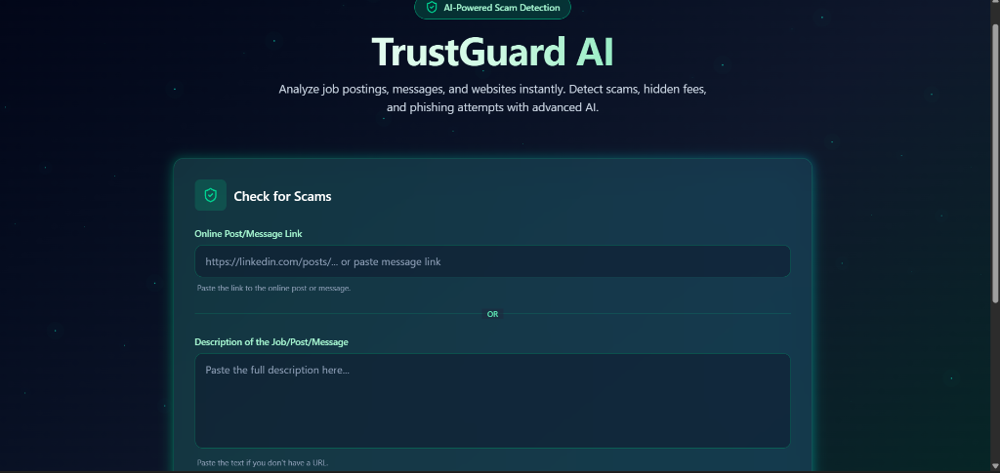
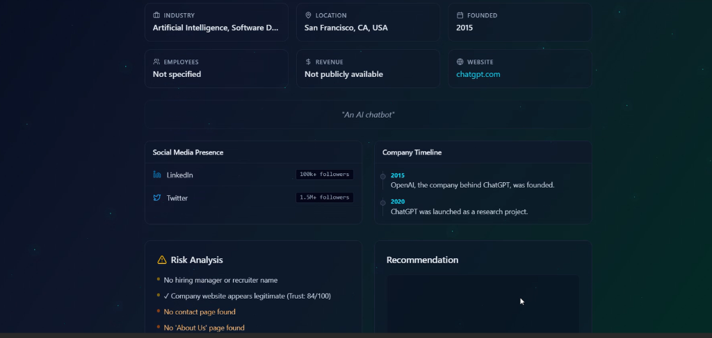

# 🛡️ TrustGuard AI

**AI-Powered Scam Detection & Risk Analysis Platform**

[]()
[]()

TrustGuard AI is an advanced security tool designed to protect users from online fraud. By analyzing job postings, messages, and websites in real-time, it detects hidden fees, phishing attempts, and scam indicators. Powered by Google Gemini AI and FireCrawl, it provides detailed risk assessments and trust scores to ensure your digital safety.

## 🚀 Live Demo

[**Launch TrustGuard AI**](https://trust-guard-ai-taupe.vercel.app/analyze)

## 📺 Video Walkthrough

[](https://youtu.be/9h4Fr6SAoy4)

## ✨ Key Features

- **🔍 Intelligent Scam Detection**: Instantly analyzes text content and URLs for fraudulent patterns.
- **📊 Trust Score & Risk Analysis**: Generates a comprehensive risk report with a calculated safety score.
- **🏢 Company Verification**: Cross-references company names with known legitimate databases.
- **⚡ Real-time Feedback**: powered by Google's Gemini Pro model for cutting-edge accuracy.
- **🎨 Interactive 3D UI**: Stunning glassmorphic design with interactive 3D elements.

## 🛠️ Tech Stack

### Frontend (Client-Side)
- **Framework**: [Next.js 16](https://nextjs.org/) (App Router)
- **Library**: [React 19](https://react.dev/)
- **Styling**: [Tailwind CSS 4](https://tailwindcss.com/)
- **Visuals**: [React Three Fiber](https://docs.pmnd.rs/react-three-fiber) (3D Glass Orb), Lucide React (Icons)
- **Language**: TypeScript

### Backend (Server-Side)
- **Framework**: [FastAPI](https://fastapi.tiangolo.com/) (Python)
- **Database**: [MongoDB](https://www.mongodb.com/) (via Motor/PyMongo)
- **AI Engine**: Google Gemini API
- **Web Scraping**: FireCrawl, BeautifulSoup4, Tldextract

## 📂 Project Structure

```bash
Trust_Guard_aii-main/
├── trustguard-frontend/     # Next.js Application
│   ├── app/                 # App Router pages and layouts
│   ├── components/          # Reusable UI components (GlassOrb, TrustScore, etc.)
│   └── public/              # Static assets
├── trustguard-backend/      # FastAPI Application
│   ├── app/                 # API routes and logic
│   ├── scripts/             # Utility scripts
│   └── run.py               # Server entry point
└── README.md                # Project Documentation
```

## 📦 Installation & Setup

### Prerequisites
- **Node.js**: v18 or higher
- **Python**: v3.9 or higher
- **MongoDB**: A running instance (local or Atlas)
- **API Keys**:
  - Google Gemini API Key
  - FireCrawl API Key

### 1. Backend Setup

Navigate to the backend directory and set up the Python environment.

```bash
cd trustguard-backend

# Install dependencies
pip install -r requirements.txt
```

Create a `.env` file in `trustguard-backend/` with your credentials:

```env
MONGODB_URI=your_mongodb_connection_string
GEMINI_API_KEY=your_gemini_api_key
FIRECRAWL_API_KEY=your_firecrawl_api_key
PORT=8081
HOST=127.0.0.1
```

Start the backend server:

```bash
python run.py
# OR
uvicorn app.main:app --reload --port 8081
```

### 2. Frontend Setup

Navigate to the frontend directory and install dependencies.

```bash
cd ../trustguard-frontend

# Install node modules
npm install
```

Start the development server:

```bash
npm run dev
```

Open [http://localhost:3000](http://localhost:3000) to view the application.

## 📸 Screenshots

| Dashboard | Analysis Report |
|-----------|----------------|
|  |  |

## 🤝 Contribution

Contributions are welcome! Please fork the repository and submit a Pull Request.

1. Fork the Project
2. Create your Feature Branch (`git checkout -b feature/AmazingFeature`)
3. Commit your Changes (`git commit -m 'Add some AmazingFeature'`)
4. Push to the Branch (`git push origin feature/AmazingFeature`)
5. Open a Pull Request
